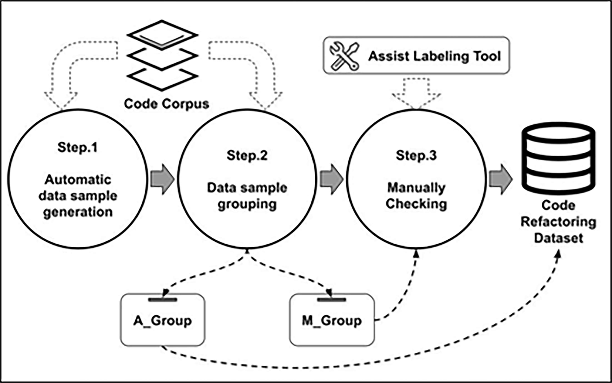

# Code Smell Refactoring Dataset

This repository contains a dataset for **code smell refactoring**, focusing on three representative types of code smells:

- **Long Method**  
- **Large Class**  
- **Feature Envy**  

The dataset is constructed using a **semi-automatic generation approach** proposed in our study. It is designed to support research on machine learning and graph-based methods for code smell detection and refactoring.

---

## 📘 Related Publications

The dataset and methodology are based on the following works:

- HanYu Zhang, Tomoji Kishi, *Long Method Detection Using Graph Convolutional Networks*, **Journal of Information Processing**, 2023, 31, pp. 469-477.  
- HanYu Zhang, Tomoji Kishi, *Large Class Detection Using GNNs: A Graph Based Deep Learning Approach Utilizing Three Typical GNN Model Architectures*, **IEICE Transactions on Information and Systems**, 2024, Volume E107.D, Issue 9, pp. 1140–115.  
- HanYu Zhang, Tomoji Kishi, *A Code Smell Refactoring Approach using GNNs* [Under Review].

---

## 🔧 Dataset Generation

The dataset was created using a semi-automatic generation process, summarized in the following figure:  



---

## 📂 Contents

- `data/` — Code smell instances organized by type.  
- `metadata/` — Supporting information about dataset construction.  
- `README.md` — Documentation of the dataset.  

(More details will be released when the related paper is published.)

---

## 📜 Citation

If you use this dataset in your research, please cite the related papers:

```bibtex
@article{Zhang2023LongMethod,
  author    = {HanYu Zhang and Tomoji Kishi},
  title     = {Long Method Detection Using Graph Convolutional Networks},
  journal   = {Journal of Information Processing},
  year      = {2023},
  volume    = {31},
  pages     = {469--477}
}

@article{Zhang2024LargeClass,
  author    = {HanYu Zhang and Tomoji Kishi},
  title     = {Large Class Detection Using GNNs: A Graph Based Deep Learning Approach Utilizing Three Typical GNN Model Architectures},
  journal   = {IEICE Transactions on Information and Systems},
  year      = {2024},
  volume    = {E107.D},
  number    = {9},
  pages     = {1140--115}
}
